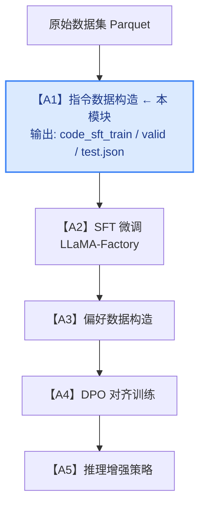
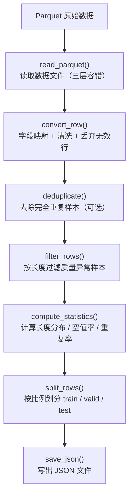

# A1 模块：推理指令数据构造

## 模块简介

本模块（A1）负责将原始 Python 代码指令数据集转换为 LLaMA-Factory 可直接使用的 SFT（Supervised Fine-Tuning）训练数据格式，是整个微调流水线的起点。

数据质量直接影响后续 SFT 训练效果，因此本模块在基础格式转换之外，还内置了**数据统计分析**、**质量过滤**、**样本预览**三大质量控制功能，实现了完整的数据清洗与质量管控流程。

---

## 在整体系统中的定位



**输入**：`python_code_instructions_18k_alpaca/` 目录下的 `.parquet` 原始数据文件

**输出**：`sft/data/` 目录下的标准 JSON 数据集文件，供 A2 模块的 LLaMA-Factory SFT 训练直接使用

---

## 环境要求

```bash
conda env create -n assignment_A python==3.11
conda activate assignment_A
pip install torch
pip install -e ./LlamaFactory -i https://pypi.tuna.tsinghua.edu.cn/simple
```

需要以下至少一个库来读取 Parquet 文件：

```bash
pip install pandas          # 首选
pip install pyarrow         # 备选
pip install datasets        # 备选
```

---

## 目录结构

```
A1/
├── python_code_instructions_18k_alpaca/   # 原始数据集目录
│   └── data/
│       └── *.parquet
├── sft/
│   ├── scripts/
│   │   ├── prepare_code_sft_data.py       # 核心数据处理脚本
│   │   └── prepare_data.sh                # 一键运行脚本
│   ├── data/                              # 输出数据目录（运行后生成）
│   │   ├── code_sft_train.json
│   │   ├── code_sft_valid.json
│   │   ├── code_sft_test.json
│   │   ├── dataset_info.json
│   │   ├── data_statistics.json
│   │   ├── sample_preview.json
│   │   └── bad_cases.json
│   └── configs/
│       └── qwen15_code_full_sft.yaml
└── LlamaFactory/                          # 训练框架
```

---

## 快速开始

```bash
# 进入项目根目录
cd /siton-tmp/assignment_A/A1

# 使用默认参数运行（推荐）
bash sft/scripts/prepare_data.sh
```

运行成功后，`sft/data/` 目录下会生成所有输出文件，并在终端打印数据质量统计摘要。

---

## 核心脚本：`prepare_code_sft_data.py`

### 处理流水线



### 函数说明

#### `read_parquet(path)` — 读取 Parquet 文件

采用三层容错机制：优先用 `pandas`，失败则尝试 `pyarrow`，再失败则尝试 `datasets`，三者全部不可用才报错。返回 `[{列名: 值}, ...]` 字典列表。

#### `convert_row(row)` — 字段转换与清洗

将原始数据行映射为标准 `instruction / input / output` 格式，处理规则如下：

| 情况 | 处理方式 |
|------|--------|
| `instruction` 缺失 | 回退使用 `prompt` 字段 |
| `output` 为空 | 丢弃该样本 |
| `instruction` 为空且 `input` 非空 | 将 `input` 提升为 `instruction` |
| `instruction` 最终仍为空 | 丢弃该样本 |

#### `deduplicate(rows)` — 去重

以 `(instruction, input, output)` 三元组为唯一键，使用 `set` 实现高效去重，只保留首次出现的样本。

#### `filter_rows(rows, ...)` — 质量过滤

按字符长度过滤不合格样本，返回 `(合格列表, 被过滤列表)` 二元组。被过滤样本附带 `filter_reasons` 字段，记录具体原因（如 `"output 过短: 8 < 10"`），写入 `bad_cases.json` 供人工审查。

#### `compute_statistics(rows, original_count)` — 数据统计

对过滤后的数据集计算质量指标，输出至 `data_statistics.json`：

- 各字段长度分布：均值、最小/最大值、中位数、25%/75% 分位数
- 各字段空值数量与空值率
- 重复样本数量与重复率

> **注意**：`original_count` 传入的是**去重后、过滤前**的数量，而非去重前数量，避免将被过滤的样本误算为重复样本。

#### `split_rows(rows, train_ratio, valid_ratio, seed)` — 数据集划分

用固定 `seed` 打乱后按比例切分为三份，保证结果可复现。默认比例：训练集 90%、验证集 5%、测试集 5%。

---

## 命令行参数

| 参数 | 默认值 | 说明 |
|------|--------|------|
| `--source_dir` | `python_code_instructions_18k_alpaca` | 原始数据目录 |
| `--output_dir` | `sft/data` | 输出目录 |
| `--limit` | `0` | 限制使用样本数（0=全部，用于快速调试） |
| `--train_ratio` | `0.90` | 训练集比例 |
| `--valid_ratio` | `0.05` | 验证集比例（测试集=剩余部分） |
| `--seed` | `42` | 随机种子 |
| `--min_output_len` | `10` | output 最短字符数（0=不限制） |
| `--max_output_len` | `4096` | output 最长字符数（0=不限制） |
| `--min_instruction_len` | `5` | instruction 最短字符数（0=不限制） |
| `--max_instruction_len` | `0` | instruction 最长字符数（0=不限制） |
| `--remove_duplicates` | `true` | 是否去重（传 `false` 可跳过） |
| `--preview_count` | `10` | 保存到 sample_preview.json 的样本数（0=不生成） |

---

## 使用示例

```bash
# 1. 默认参数运行（推荐首次使用）
bash sft/scripts/prepare_data.sh

# 2. 调试模式：只取前 200 条数据，快速验证流程
LIMIT=200 bash sft/scripts/prepare_data.sh

# 3. 加严质量过滤：output 至少 50 字符
MIN_OUTPUT_LEN=50 bash sft/scripts/prepare_data.sh

# 4. 同时设置 output 长度上下限
MIN_OUTPUT_LEN=30 MAX_OUTPUT_LEN=2048 bash sft/scripts/prepare_data.sh

# 5. 关闭去重（保留所有重复样本）
REMOVE_DUPLICATES=false bash sft/scripts/prepare_data.sh

# 6. 保存更多预览样本（便于人工抽查）
PREVIEW_COUNT=50 bash sft/scripts/prepare_data.sh

# 7. 直接调用 Python 脚本，自定义所有参数
python sft/scripts/prepare_code_sft_data.py \
  --source_dir python_code_instructions_18k_alpaca \
  --output_dir sft/data \
  --train_ratio 0.90 \
  --valid_ratio 0.05 \
  --min_output_len 30 \
  --max_output_len 2048 \
  --preview_count 20 \
  --seed 42
```

---

## 输出文件说明

运行完成后，`sft/data/` 目录下会生成以下文件：

| 文件 | 说明 | 用途 |
|------|------|------|
| `code_sft_train.json` | 训练集（默认约 90%） | 供 A2 模块 SFT 训练 |
| `code_sft_valid.json` | 验证集（默认约 5%） | 训练过程中评估 loss |
| `code_sft_test.json` | 测试集（默认约 5%） | 训练完成后最终评测 |
| `dataset_info.json` | LLaMA-Factory 数据集注册表 | 让训练框架识别数据集路径 |
| `data_statistics.json` | 数据质量统计指标 | 分析数据质量、对比过滤前后变化 |
| `sample_preview.json` | 筛选后样本示例（前 N 条） | 人工检查数据格式与内容质量 |
| `bad_cases.json` | 被过滤样本及过滤原因 | 审查过滤规则是否合理、是否过严 |

### 训练集样本格式（`code_sft_train.json`）

```json
[
  {
    "instruction": "Write a Python function to find the maximum element in a list.",
    "input": "",
    "output": "def find_max(lst):\n    return max(lst)"
  }
]
```

### 样本预览格式（`sample_preview.json`）

额外附带各字段字符长度，便于快速判断数据规模是否符合预期：

```json
[
  {
    "index": 0,
    "instruction": "Write a Python function ...",
    "input": "",
    "output": "def find_max(lst):\n    return max(lst)",
    "instruction_len": 52,
    "input_len": 0,
    "output_len": 38
  }
]
```

### 被过滤样本格式（`bad_cases.json`）

附带 `filter_reasons` 字段，说明被过滤的具体原因：

```json
[
  {
    "index": 0,
    "filter_reasons": ["output 过短: 8 < 10"],
    "instruction": "Print hello",
    "input": "",
    "output": "print()",
    "instruction_len": 11,
    "input_len": 0,
    "output_len": 7
  }
]
```

---

## 运行输出示例

运行脚本后，终端会打印以下信息：

```
Read 18612 raw rows from 1 parquet file(s).
Kept 18340 valid unique rows.
Wrote train: 16506 -> sft/data/code_sft_train.json
Wrote valid: 917 -> sft/data/code_sft_valid.json
Wrote test : 917 -> sft/data/code_sft_test.json
Wrote registry -> sft/data/dataset_info.json

========== 数据质量过滤 ==========
去重开关            : 开启
instruction 长度限制: [5, 不限]
output 长度限制     : [10, 4096]
原始有效样本数      : 18612
去重删除样本数      : 0  (去重后剩余: 18612)
质量过滤删除样本数  : 272
最终样本数          : 18340
bad_cases 已保存 -> sft/data/bad_cases.json  (272 条)
sample_preview 已保存 -> sft/data/sample_preview.json  (前 10 条)

========== 数据质量统计 ==========
参与统计样本数 : 18340  (去重+过滤后)

[instruction]
  空值数量 : 0  (空值率: 0.00%)
  平均长度 : 124.3 字符
  最短/最长: 15 / 512 字符
  中位数   : 98 字符
  25%/75%  : 67 / 156 字符

[input]
  空值数量 : 18340  (空值率: 100.00%)
  平均长度 : 0.0 字符
  最短/最长: 0 / 0 字符
  中位数   : 0 字符
  25%/75%  : 0 / 0 字符

[output]
  空值数量 : 0  (空值率: 0.00%)
  平均长度 : 187.5 字符
  最短/最长: 10 / 4095 字符
  中位数   : 142 字符
  25%/75%  : 89 / 231 字符

统计文件已保存 -> sft/data/data_statistics.json
===================================
```

---

## 进阶功能

### 1. 数据统计模块

脚本内置 `compute_statistics()` 函数，对过滤后的完整数据集计算长度分布、空值率等指标，结果保存至 `data_statistics.json`，可用于：

- 判断数据是否存在质量问题（如大量短输出、高空值率）
- 对比不同过滤参数下的数据分布变化
- 为 Proposal 报告提供客观的数据质量数据支撑

### 2. 数据质量过滤

通过 `--min_output_len`、`--max_output_len`、`--min_instruction_len`、`--max_instruction_len` 四个参数，灵活控制过滤阈值。被过滤样本附带原因写入 `bad_cases.json`，便于：

- 检查哪类样本被过滤（太短/太长）
- 判断过滤阈值设置是否合理
- 迭代优化过滤策略

### 3. 样本预览

通过 `--preview_count` 参数控制 `sample_preview.json` 的样本数量，预览文件附带每个字段的字符长度，可直观判断：

- 数据格式是否符合预期
- instruction 与 output 的典型长度和内容风格
- 是否存在明显的格式错误或异常内容

---

## 参考资料

- 原始数据集：[iamtarun/python_code_instructions_18k_alpaca](https://huggingface.co/datasets/iamtarun/python_code_instructions_18k_alpaca)
- 训练框架：[LLaMA-Factory](https://github.com/hiyouga/LLaMA-Factory)
- 基础模型：[Qwen1.5-0.5B-Chat](https://huggingface.co/Qwen/Qwen1.5-0.5B-Chat)
