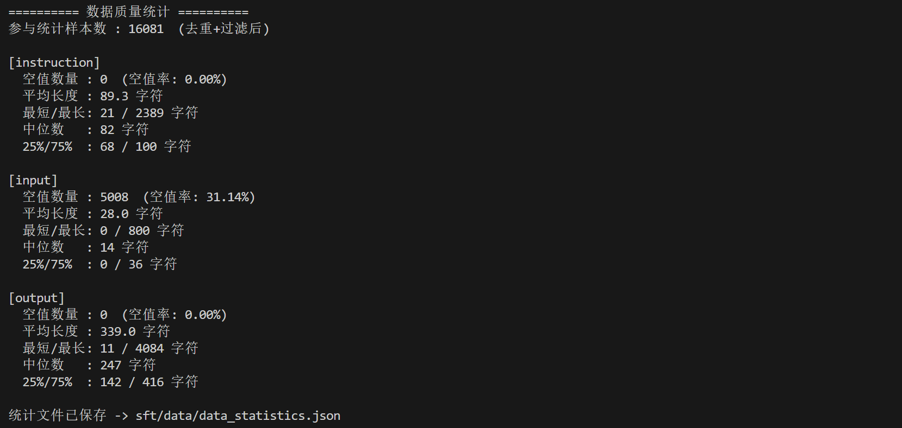
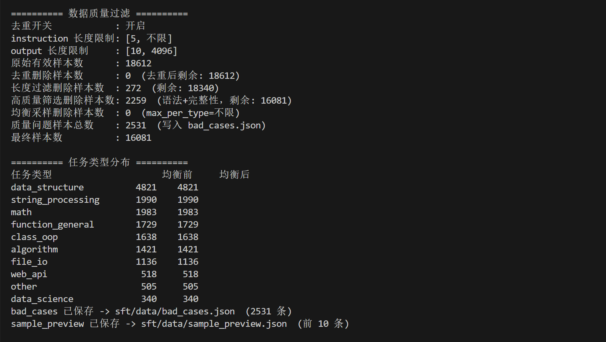

# Module A1 推理指令数据构造模块

> 本模块负责 A 方向「代码生成」任务的数据构造环节，为下游 SFT 训练提供干净、规范、高质量的指令数据。

---

## 1. 模块概述

### 1.1 模块名称

`A1 - 推理指令数据构造（Code Instruction Data Preparation）`

### 1.2 模块说明

本模块位于整个「Qwen1.5-0.5B-Chat Python 代码指令微调(SFT)」流水线的**最前端**，负责把原始的 `python_code_instructions_18k_alpaca` parquet 数据集转换为 LLaMA-Factory 可直接使用的 Alpaca 格式 JSON，并完成清洗、去重、质量过滤、统计分析和 train/valid/test 划分。

它是完整系统必要的一环：下游的 SFT 训练、批量推理、代码执行评测都依赖本模块产出的规范数据。数据质量直接决定训练是否稳定（例如语法不可解析、被截断的脏样本会导致训练出现梯度爆炸）以及最终模型的代码生成能力。

```text
输入：python_code_instructions_18k_alpaca 原始 parquet 数据集
处理：读取 → 字段规范化 → 去重 → 长度过滤 → 高质量筛选 → 任务类型均衡 → 统计 → 划分
输出：code_sft_train.json / code_sft_valid.json / code_sft_test.json + 统计与诊断文件
```

### 1.3 完成情况概览

| 类型 | 完成情况 |
|---|---|
| 基础要求 | parquet → Alpaca JSON 转换、字段清洗、去重、train/valid/test 划分 |
| 进阶要求 | ①数据统计模块 ②数据质量过滤参数 ③样本预览与 bad_cases 导出 ④高质量数据筛选策略（语法可解析性 + 任务完整性 + 任务类型均衡） |
| 可独立运行的演示 | `bash sft/scripts/prepare_data.sh` 或直接调用 `prepare_code_sft_data.py` |
| 与团队系统集成情况 | 产出的 `code_sft_*.json` 由 `train.sh` 通过 `dataset_info.json` 注册后供 LLaMA-Factory 训练 |

---

## 2. 环境、模型与数据依赖

### 2.1 运行环境

| 项目 | 要求 |
|---|---|
| Python 版本 | 3.11 |
| 必要依赖 | `pandas` 或 `pyarrow` 或 `datasets`（三者任一即可读取 parquet）；                                                                               标准库 `ast`、`json`、`argparse`、`random`、`re`、`collections` |
| 是否需要模型 | 否 |
| 是否需要 GPU | 否 |
| 是否需要外部数据集 | 是（`python_code_instructions_18k_alpaca`，项目已自带） |

### 2.2 模型依赖

本模块为纯数据处理，不依赖任何模型。

### 2.3 数据集或样例数据依赖

| 数据或文件 | 来源 | 项目内相对路径 | 用途 |
|---|---|---|---|
| `python_code_instructions_18k_alpaca` | HuggingFace 公开数据集 | `python_code_instructions_18k_alpaca/data/*.parquet` | 原始 Python 代码指令数据，约 18k 条 |

（要求）原始数据字段划分为 Alpaca 三元组：`instruction`（任务描述）、`input`（可选输入）、`output`（Python 代码答案）。

```bash
# 数据集已随项目提供，无需额外下载
ls python_code_instructions_18k_alpaca/data/*.parquet
```

### 2.4 安装步骤

```bash
# 只需保证 parquet 读取库任一可用即可
pip install pandas        # 推荐
# 或
pip install pyarrow
```

本模块可脱离完整系统独立运行，最小依赖仅为一个 parquet 读取库。

---

## 3. 文件结构与接口边界

### 3.1 文件结构

```text
sft/
├── scripts/
│   ├── prepare_code_sft_data.py   # 【核心】数据构造主脚本，本模块全部逻辑
│   ├── prepare_data.sh            # 便捷启动脚本，封装常用参数为环境变量
│   └── README.md                  # 本模块说明文档
└── data/                          # 输出目录
    ├── code_sft_train.json        # 训练集（约 90%）
    ├── code_sft_valid.json        # 验证集（约 5%）
    ├── code_sft_test.json         # 测试集（约 5%）
    ├── dataset_info.json          # LLaMA-Factory 数据集注册文件
    ├── data_statistics.json       # 数据质量统计报告
    ├── sample_preview.json        # 筛选后样本预览
    └── bad_cases.json             # 被过滤样本及过滤原因
```

### 3.2 接口边界

| 类型 | 来源 / 去向 | 数据格式 | 说明 |
|---|---|---|---|
| 输入 | `python_code_instructions_18k_alpaca` 原始数据集 | parquet（含 instruction/input/output 字段） | 由脚本自动发现并读取 |
| 输出 | 供下游 `train.sh` → LLaMA-Factory 训练 | Alpaca JSON（instruction/input/output 三字段） | 通过 `dataset_info.json` 注册 |
| 输出 | 供人工检查与调参 | JSON | 统计报告、样本预览、bad_cases |

---

## 4. 基础要求实现与演示

### 4.1 基础功能说明

基础功能完成「原始 parquet → LLaMA-Factory Alpaca JSON」的转换，包含四个核心步骤：

```text
1. 读取 parquet（多后端容错：pandas → pyarrow → datasets）
2. 字段规范化：清洗空白字、处理 instruction/input 缺失、丢弃无 output 的样本
3. 精确去重：按 (instruction, input, output) 三元组去重
4. 数据划分：按比例随机切分为 train/valid/test 三个子集
```

### 4.2 基础功能实现路径

| 文件 / 函数 | 作用 |
|---|---|
| `read_parquet()` | 高容错读取 parquet，任一读取库可用即可 |
| `find_parquet_files()` | 自动定位数据目录下的 parquet 文件 |
| `convert_row()` | 单行字段规范化：清洗、缺失字段转换、丢弃无效样本 |
| `deduplicate()` | 基于三元组集合的精确去重 |
| `split_rows()` | 按 train/valid 比例随机划分，并校验无空子集 |
| `save_json()` | 统一的 UTF-8 JSON 写出 |

流程：

```text
[parquet] -> convert_row -> deduplicate -> [长度/质量过滤] -> split_rows -> [三个 JSON]
```

### 4.3 基础功能输入格式与样例

| 输入文件 | 格式 | 是否必需 | 说明 |
|---|---|---|---|
| `*.parquet` | parquet | 是 | 含 `instruction` / `input` / `output` 列 |

单条原始样本示例：

```json
{
  "instruction": "Write a Python function to check whether a string is a palindrome.",
  "input": "",
  "output": "def is_palindrome(s):\n    return s == s[::-1]"
}
```

### 4.4 基础功能演示命令

```bash
# 使用默认参数一键处理（脚本内部会切到项目根目录）
bash sft/scripts/prepare_data.sh

# 快速小样本调试（只取 1000 条）
LIMIT=1000 bash sft/scripts/prepare_data.sh
```

运行后应观察到：

- 控制台打印读取的原始条数、去重后条数、最终写出条数
- `sft/data/` 下生成 `code_sft_train.json` / `code_sft_valid.json` / `code_sft_test.json`
- 生成 `dataset_info.json` 供 LLaMA-Factory 识别

### 4.5 基础功能输出格式

| 输出文件 | 格式 | 说明 |
|---|---|---|
| `code_sft_train/valid/test.json` | Alpaca JSON 数组 | 每条含 instruction/input/output 三字段 |
| `dataset_info.json` | JSON | 数据集注册表，映射数据集名 → 文件名 |

### 4.6 基础功能结果截图




---

## 5. 进阶要求实现与演示

### 5.1 选择的进阶要求

| 进阶要求 | 是否完成 | 对应文件 / 函数 | 简要说明 |
|---|---|---|---|
| ① 数据统计模块 | 是 | `compute_statistics()` | 统计各字段长度分布、空值率、重复率 |
| ② 数据质量过滤参数 | 是 | `filter_rows()` + CLI 参数 | 按长度过滤过短/过长/异常样本，可开关去重 |
| ③ 样本预览与 bad_cases | 是 | `main()` 中的导出逻辑 | 导出 `sample_preview.json` 与 `bad_cases.json` |
| ④ 高质量数据筛选策略 | 是 | `high_quality_filter()` + `balance_task_types()` | 语法可解析性 + 任务完整性 + 任务类型均衡 |

### 5.2 进阶功能 1：数据统计模块

#### 功能说明

统计 instruction / input / output 三个字段的长度分布（均值、最值、中位数、P25、P75）、空值数量与比例、以及整体重复率，帮助人工判断数据质量并指导过滤参数选择。

#### 实现路径

| 文件 / 函数 | 作用 |
|---|---|
| `compute_statistics()` | 计算各字段长度统计、空值率、重复率，返回统计字典 |

#### 输出格式

| 输出文件 | 格式 | 说明 |
|---|---|---|
| `data_statistics.json` | JSON | 完整统计报告，含各字段分布与任务类型分布 |

控制台同时打印可读的统计摘要。

### 5.3 进阶功能 2：数据质量过滤参数

#### 功能说明

提供一组命令行参数，按字符长度过滤过短、过长的样本，并可开关去重，剔除格式异常样本。过短的 output（如 11~14 字符）会造成训练 loss 方差过大，是导致训练不稳定的诱因之一。

#### 实现路径

| 文件 / 函数 | 作用 |
|---|---|
| `filter_rows()` | 按 instruction/output 长度上下限过滤，记录每条被过滤的原因 |

#### 输入格式与样例（CLI 参数）

| 参数 | 类型 | 默认值 | 说明 |
|---|---|---|---|
| `--min_output_len` | int | 10 | output 最短字符数（0=不限） |
| `--max_output_len` | int | 4096 | output 最长字符数（0=不限） |
| `--min_instruction_len` | int | 5 | instruction 最短字符数 |
| `--max_instruction_len` | int | 0 | instruction 最长字符数（0=不限） |
| `--remove_duplicates` | bool | true | 是否去重 |

#### 演示命令

```bash
MIN_OUTPUT_LEN=20 MAX_OUTPUT_LEN=2048 bash sft/scripts/prepare_data.sh
```

### 5.4 进阶功能 3：样本预览与 bad_cases 导出

#### 功能说明

导出筛选后的正样本预览（`sample_preview.json`）和所有被过滤样本及其过滤原因（`bad_cases.json`），便于人工检查数据格式、验证过滤规则是否合理，进而迭代优化筛选策略。

#### 实现路径

| 文件 / 函数 | 作用 |
|---|---|
| `main()` 导出逻辑 | 生成带长度元信息的预览样本；生成带 `filter_reasons` 的被过滤样本清单 |

#### 输出格式

| 输出文件 | 格式 | 说明 |
|---|---|---|
| `sample_preview.json` | JSON | 前 N 条合格样本，附带各字段长度 |
| `bad_cases.json` | JSON | 被过滤样本，附带过滤原因与长度 |

#### 演示命令

```bash
PREVIEW_COUNT=20 bash sft/scripts/prepare_data.sh
```

### 5.5 进阶功能 4：高质量数据筛选策略

#### 功能说明

围绕题目要求的**五个维度**（代码语法可解析性、输出长度、任务完整性、重复率、任务类型均衡性）实现高质量筛选，尝试用**更少但更高质量**的数据实现高效 SFT。

| 维度 | 实现方式 |
|---|---|
| 代码语法可解析性 | `ast.parse()` 尝试解析 output，过滤 Python2 残留（如 `print 'x'`）、截断代码、语法错误 |
| 输出长度 | 进阶功能 2 已实现 |
| 任务完整性 | 检查 instruction/output 非空，且 output 不含占位符（`# TODO`、`...`、`raise NotImplementedError`）或截断标记 |
| 重复率 | 基础功能 已实现 |
| 任务类型均衡性 | 按关键词把样本分为 10 类，每类最多保留 `max_per_type` 条，避免类别偏斜 |

#### 实现路径

| 文件 / 函数 | 作用 |
|---|---|
| `is_python_parsable()` | 用 `ast.parse` 判断 output 是否语法可解析 |
| `is_task_complete()` | 判断任务是否完整（无空字段、无占位符/截断） |
| `classify_task_type()` | 按 instruction 关键词归类到 10 种任务类型 |
| `high_quality_filter()` | 组合语法 + 完整性过滤，并给通过样本打上 `task_type` |
| `balance_task_types()` | 按任务类型分桶，做上限均衡采样 |

处理流程（在原流水线中新增两步）：

```text
清洗 -> 去重 -> 长度过滤 -> 高质量筛选(语法+完整性) -> 任务类型均衡采样 -> 统计 -> 划分
```

部分关键代码片段（语法可解析性判断）：

```python
def is_python_parsable(code: str) -> bool:
    stripped = code.strip()
    if not stripped:
        return False
    try:
        ast.parse(stripped)   # 解析成功 = 语法完整、无 Python2 残留、无截断
        return True
    except (SyntaxError, ValueError):
        return False
```

#### 输入格式与样例（CLI 参数）

| 参数 | 类型 | 默认值 | 说明 |
|---|---|---|---|
| `--high_quality` | bool | true | 是否启用高质量筛选 |
| `--require_parsable` | bool | true | 是否要求 output 语法可解析 |
| `--require_complete` | bool | true | 是否要求任务完整 |
| `--max_per_type` | int | 0 | 每类任务样本上限（0=不限，用于均衡采样） |

#### 演示命令

```bash
# 启用高质量筛选，并对每类任务做上限 1500 条的均衡采样
python sft/scripts/prepare_code_sft_data.py \
  --source_dir python_code_instructions_18k_alpaca \
  --output_dir sft/data \
  --max_per_type 1500
```

#### 输出格式

| 输出文件 / 字段 | 格式 | 说明 |
|---|---|---|
| `data_statistics.json` 的 `task_type_distribution`  字段 | JSON | 均衡采样前后的任务类型分布 |
| `bad_cases.json` | JSON | 新增「语法不可解析」「任务不完整」两类过滤原因 |
| 控制台打印任务类型分布表 | 文本 | 打印各类型均衡前 vs 均衡后数量 |

#### 示例图片



---

## 6. 与团队系统的集成说明

本模块作为流水线最前端，与团队系统的对接方式如下：

- **调用入口**：训练前，先运行 `bash sft/scripts/prepare_data.sh` 生成数据。
- **传入内容**：通过环境变量传参（`LIMIT`、`MIN_OUTPUT_LEN`、`MAX_PER_TYPE` 等），指定源目录与输出目录。
- **返回结果**：在 `sft/data/` 下产出三个数据集 JSON 与 `dataset_info.json`。
- **注册机制**：LLaMA-Factory 通过 `dataset_info.json` 把 `code_sft_train` / `code_sft_valid` 注册为可用数据集，训练配置 `qwen15_code_full_sft.yaml` 中通过 `dataset:` / `eval_dataset:` 引用。
- **格式约定**：保存前会剥离辅助字段 `task_type`，只保留 `instruction/input/output` 三字段，确保严格符合 LLaMA-Factory Alpaca 格式。

联调经验：验证集中的脏样本（语法不可解析）曾在训练评估阶段引发梯度爆炸并污染优化器状态，导致 grad_norm 归零。启用本模块的高质量筛选（`--require_parsable`）后可从源头清除这类样本。

---

## 7. 已知问题与后续改进

| 问题 | 当前原因 | 后续改进 |
|---|---|---|
| 长度过滤基于字符数，与训练时的 token 数（cutoff_len）不完全对应 | 未在数据构造阶段做 tokenizer 级别的长度统计 | 引入 tokenizer 按 token 数过滤，与 `cutoff_len` 对齐 |
| 任务类型分类基于关键词规则，存在误分类 | 规则匹配无法覆盖全部语义 | 后续可用轻量分类模型或 embedding 聚类替代 |
| 语法检查仅覆盖 Python，且只判断可解析性 | `ast.parse` 不校验运行时正确性 | 可补充「可执行性」抽样校验（如 MBPP 执行评测联动） |
